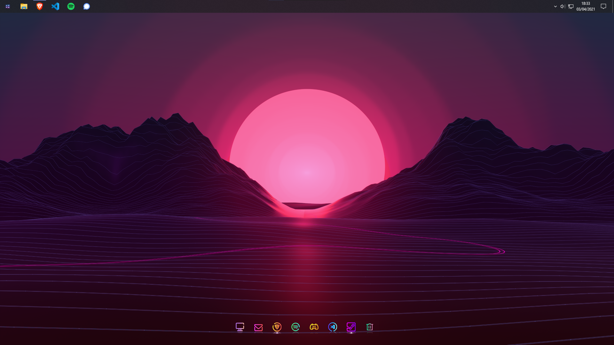

# Windows

OS : Windows 10 Professionnel

## Applications

| Nom                                                                                          | Description                              |
| -------------------------------------------------------------------------------------------- | ---------------------------------------- |
| [7-Zip](https://www.7-zip.org/download.html)                                                 | Archiveur de fichiers                    |
| [Armoury Crate](https://rog.asus.com/us/innovation/armoury_crate/)                           | Lumières RGB carte-mère                  |
| [Brave](https://brave.com/download/)                                                         | Navigateur web                           |
| [Discord](https://discord.com/download)                                                      | Application de chat                      |
| [iCue](https://www.corsair.com/fr/fr/icue)                                                   | Lumières RGB RAM                         |
| [Spotify](https://www.spotify.com/download)                                                  | Application de musique                   |
| [Spybot Anti-Beacon](https://www.safer-networking.org/products/spybot-anti-beacon/download/) | Suppression des trackers sous Windows 10 |
| [Thunderbird](https://www.thunderbird.net/fr/)                                               | Messagerie                               |
| [Visual Studio Code](https://code.visualstudio.com/download)                                 | Éditeur de texte                         |

## Config

| Pièce             | Modèle                                                                                            |
| ----------------- | ------------------------------------------------------------------------------------------------- |
| Alimentation      | Antec EarthWatts EA-650G Pro 650W                                                                 |
| Boîtier           | Cooler Master MasterBox K500L (Noir/Transparent)                                                  |
| Cable DisplayPort | Amazon Basics Câble DisplayPort vers DisplayPort - 3 m                                            |
| Carte graphique   | GIGABYTE GeForce RTX 2070 SUPER GAMING OC 8G                                                      |
| Carte mère        | Asus TUF Gaming X570-Plus                                                                         |
| Écran             | ViewSonic VX2458-C-mhd                                                                            |
| Processeur        | AMD Ryzen 5 3600 (3,6 GHZ, 6 cœurs, 12 threads)                                                   |
| RAM               | Corsair VENGEANCELPX16GB (2x8Go DDR4 3200 MHz) + Corsair Vengeance RGB PRO (2x8Go, DDR4, 3200MHz) |
| SSD               | Samsung 860 QVO MZ-76Q1T0BW 1To                                                                   |

## Configuration Brave

Moteur de recherche : DuckDuckGo

Extensions :
| Nom                                          | Description                  |
| -------------------------------------------- | ---------------------------- |
| [Bitwarden](https://bitwarden.com/download/) | Gestionnaire de mot de passe |

Configuration :
- Désactivation des images d'arrière-plan sponsorisées

## Configuration VSCode

Installation : version système 64 bits

## Personnalisation

- [UltraUXThemePatch (Installation de thèmes de tiers)](https://mhoefs.eu/software_uxtheme.php)
- Thème d'icone : [Sweet Paranoia Icon Theme](https://www.deviantart.com/niivu/art/Sweet-Paranoia-Icon-Theme-860564822)
- Thème Windows : [Paranoid Android Windows 10 Themes > Pure Dark > Nebula](https://www.deviantart.com/niivu/art/Paranoid-Android-Windows-10-Themes-821696974)
- Dock : [Nexus](https://www.winstep.net/nexus.asp)
